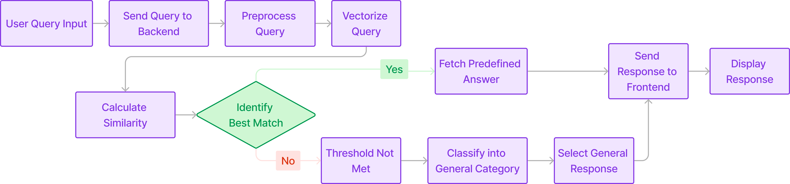

# MoodMate: A mate for your every mood

Welcome to **MoodMate**, your dedicated mental health support chatbot designed to be a beacon of hope and tranquility in your daily life. Whether you’re dealing with stress, anxiety, or simply need someone to talk to, MindMend is here to listen and guide you through your emotional journey.

## Features

- **24/7 Availability:** MindMend is always here for you, day or night, ready to provide support whenever you need it.
- **Personalized Conversations:** Tailored responses and guidance based on your unique needs and emotional state.
- **Mindfulness Exercises:** Access to a variety of mindfulness and relaxation exercises to help you stay grounded and centered.
- **Mood Tracking:** Keep track of your emotional health over time with our easy-to-use mood tracking feature.
- **Resource Library:** Explore a wide range of articles, tips, and strategies for maintaining mental wellness.

## Why Choose MoodMate?

- **Confidential and Secure:** Your privacy is our priority. All conversations are encrypted and confidential.
- **Empathetic and Non-judgmental:** MindMend provides a safe space where you can express yourself freely without fear of judgment.
- **AI-Driven Insights:** Leveraging advanced AI, MindMend offers insightful advice and coping strategies based on the latest psychological research.

Join the MindMend community today and take a proactive step towards a healthier, happier you. Because everyone deserves to feel understood, supported, and valued.

## Website Workflow Diagram



## How to use this repository

To use this repository, follow these steps:

1. **Clone the Repository**: 
    ```
    git clone https://github.com/Annarhysa/MoodMate.git
    ```
2. **Create a Virtual Environment** (Optional but recommended):
    ```
    python -m venv moodmate
    ```
3. **Activate the Virtual Environment**:
    - On Windows:
    ```
    moodmate\Scripts\activate
    ```
    - On Unix or MacOS:
    ```
    source moodmate/bin/activate
    ```
4. **Install Dependencies**:
    ```
    pip install -r requirements.txt
    ```
5. **Run the Flask App**:
    - First go to the required directory: 
    ```
    cd backend
    ```
    - Now run the flask app in backend:
    ```
    python app.py
    ```
6. **Open the HTML File**:
    Run the HTML file (index.html) in any browser of choice 
7. **Have a good time with your mate!**
